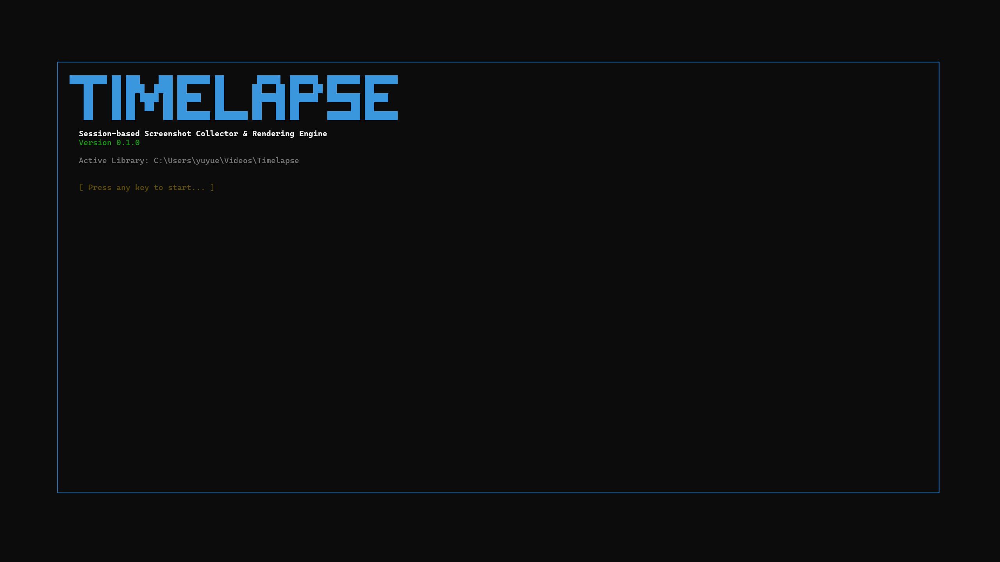
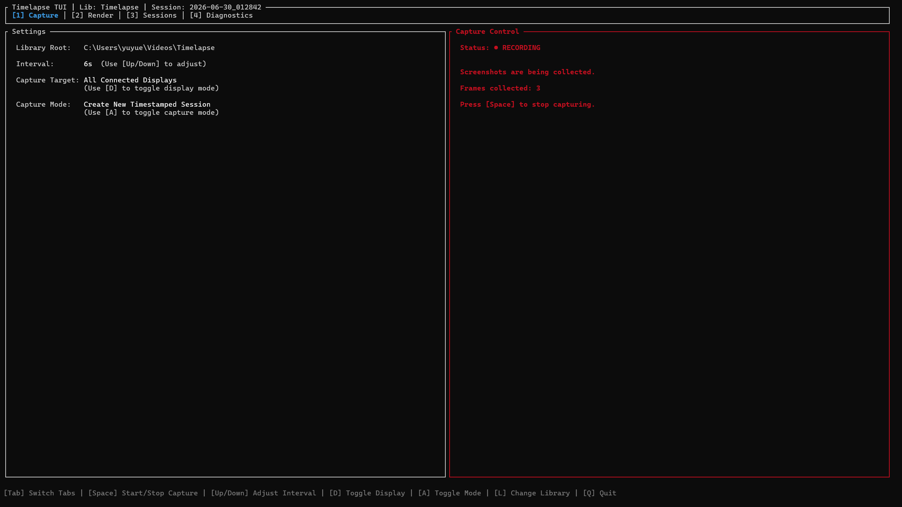
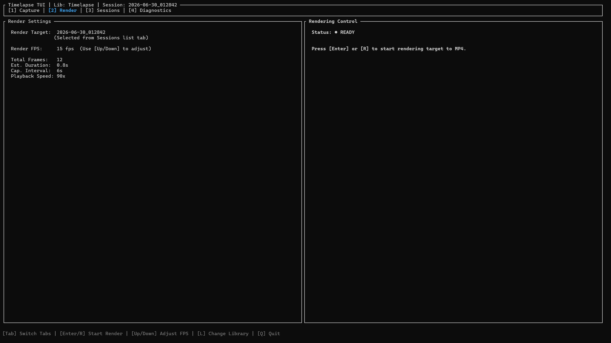
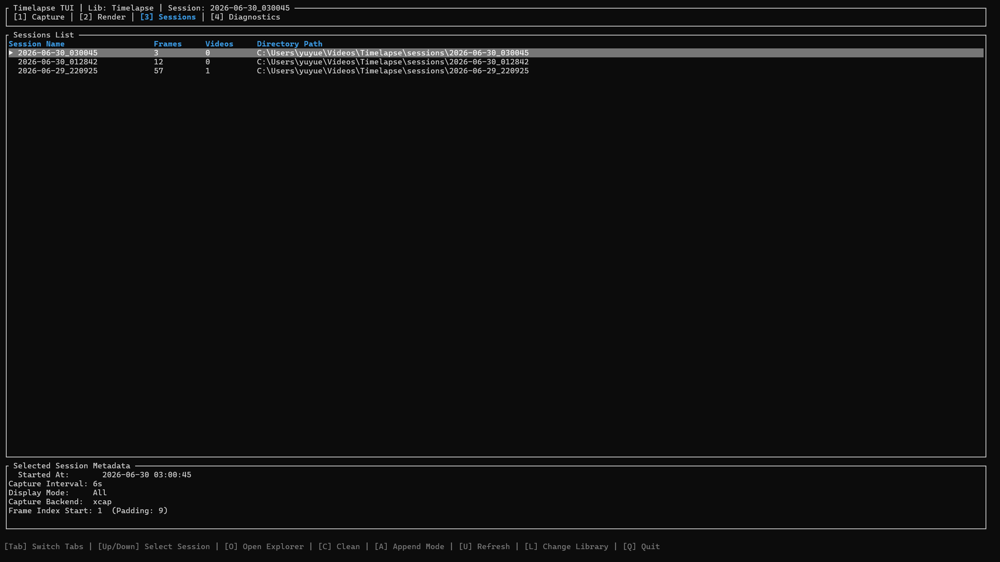
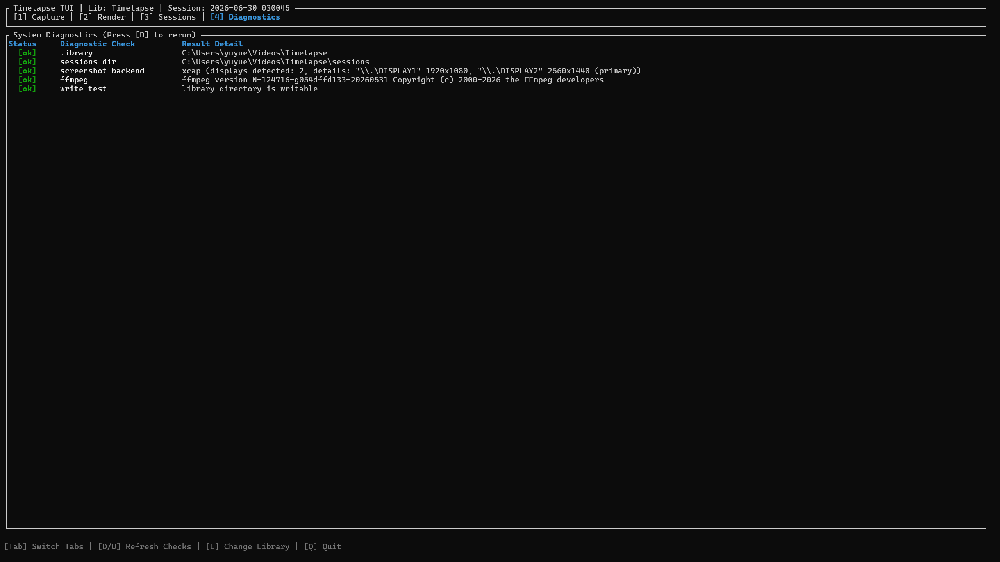

# Timelapse

Session-based screenshot collection and timelapse rendering.

> [!WARNING]
> This project is in very early alpha status. Please use it with care as features and session layouts are subject to change.

This project is a Rust implementation of a session-based screenshot collection and timelapse rendering tool.

## Requirements

- Rust toolchain
- `ffmpeg` available in `PATH` for rendering

## Build

```sh
cargo build
```

Run from the workspace:

```sh
cargo run -- --help
```

## Session Layout

By default, `collect` creates timestamped sessions under the Timelapse library:

```text
~/Videos/Timelapse/
  sessions/
    2026-06-29_220503/
      frames/
        000000001.png
        000000002.png
      session.toml
      2026-06-29_220503.mp4
```

The default library path prefers the user's video directory. You can override it with `--library`.

## Commands

```sh
timelapse collect
timelapse render latest
timelapse list
timelapse open latest
timelapse clean latest --frames
timelapse doctor
timelapse default-library
timelapse tui
timelapse exclude latest
```

When running through Cargo, place arguments after `--`:

```sh
cargo run -- collect
cargo run -- render latest
cargo run -- exclude latest
cargo run -- tui
```

## Collect

Collect screenshots into a session folder:

```sh
cargo run -- collect
cargo run -- collect --interval 6s
cargo run -- collect --display all
cargo run -- collect --library ~/Videos/Timelapse
```

Use an exact session directory:

```sh
cargo run -- collect --session ./my-session
```

Append to an existing explicit session:

```sh
cargo run -- collect --session ./my-session --append
```

Append reads `session.toml` when available. If the requested interval differs from the existing session metadata, append fails unless `--force` is passed:

```sh
cargo run -- collect --session ./my-session --append --interval 10s --force
```

`--force` is intentionally narrow: it only allows append metadata mismatch or missing metadata. It does not overwrite sessions or delete files.

## Render

Render the newest session in the library:

```sh
cargo run -- render latest
cargo run -- render latest --library ~/Videos/Timelapse
```

Render a session directory or a plain numbered PNG frames directory:

```sh
cargo run -- render ./my-session
cargo run -- render ./my-session/frames
```

Render options:

```sh
cargo run -- render ./my-session --fps 15
cargo run -- render ./my-session --output ./out.mp4
cargo run -- render ./my-session --overwrite
cargo run -- render ./my-session --verbose
cargo run -- render ./my-session --exclude 1,2,5-10
```

Rendering:

- Uses external `ffmpeg`.
- Infers frame padding and start number from numbered PNG files.
- Fails if there are missing frame numbers (unless they are excluded).
- Supports excluding frames using:
  - `--exclude <FRAMES>` CLI flag (e.g., `1,2,5-10` or a space-separated list of dragged-and-dropped file paths).
  - An `exclude.txt` file in the target directory (with frame numbers/ranges, e.g. `1-10` or `1,2,5-10`, and `#` comments).
- Uses FFmpeg's `concat` demuxer under the hood when exclusions are active.
- Does not require `session.toml`.
- Does not overwrite existing output unless `--overwrite` is passed.
- Hides ffmpeg output by default; use `--verbose` to show it.

## List

Inspect sessions in the Timelapse library:

```sh
cargo run -- list
cargo run -- list --library ~/Videos/Timelapse
```

`list` shows each session path, frame count/range, video count, and metadata when available.

## Open

Open a session in the system file manager:

```sh
cargo run -- open latest
cargo run -- open latest --library ~/Videos/Timelapse
cargo run -- open ./my-session
```

## Clean

Permanently delete generated files from a recognized session:

```sh
cargo run -- clean latest --frames
cargo run -- clean latest --videos
cargo run -- clean ./my-session --frames --videos
cargo run -- clean ./my-session --frames --dry-run
cargo run -- clean ./my-session --frames --yes
```

Clean is intentionally conservative:

- It only works on session folders, not arbitrary raw frame directories.
- You must pass `--frames`, `--videos`, or both.
- It deletes numbered PNG frames from `frames/`.
- It deletes MP4 videos from the session directory.
- `--dry-run` shows the deletion plan without deleting files.
- It asks for confirmation unless `--yes` is passed.

## Exclude

Manage frame exclusions for a session or frames directory using `exclude.txt` as the single source of truth:

```sh
# View current exclusions (explicitly)
cargo run -- exclude latest --show
cargo run -- exclude ./my-session --show

# Add exclusions (merges new exclusions with existing ones)
cargo run -- exclude latest --add 1 2 5-10
cargo run -- exclude ./my-session --add C:\path\001.png C:\path\002.png

# Open the folder with exclude.txt selected in the system file manager
cargo run -- exclude latest
cargo run -- exclude ./my-session
```

`exclude` is dedicated to managing persistent exclusions:
- `--show` (or `-s`): Prints current exclusions in `exclude.txt`.
- `--add` (or `-a`): Appends/merges new exclusions (frame numbers, ranges, or file paths) to `exclude.txt`, maintaining them sorted and de-duplicated.
- Default Behavior: Running without `--show` or `--add` creates `exclude.txt` if it doesn't exist and opens the system file manager with the `exclude.txt` file highlighted/selected for manual editing. (Deletion is not supported directly in the CLI; do it by opening `exclude.txt` via this command).

## Doctor

Check whether the local environment is ready for screenshot capture and timelapse rendering:

```sh
cargo run -- doctor
cargo run -- doctor --library ~/Videos/Timelapse
```

This runs diagnostics on:
- **Library**: Verifies the default or provided library path. If it doesn't exist, reports that it will be created.
- **Sessions Directory**: Warns if the sessions directory is missing (since `collect` will auto-create it).
- **Screenshot Backend**: Verifies the capture backend (`xcap`), listing all detected displays, their resolutions, and primary status.
- **ffmpeg**: Verifies `ffmpeg` is available in `PATH` and reports its version.
- **Write Test**: Performs a conservative write/delete test with a temporary file in the library directory (or its nearest existing parent).

## Default Library

Print the resolved default library path:

```sh
cargo run -- default-library
```

## TUI

Launch the interactive Terminal User Interface (TUI):

```sh
cargo run -- tui
cargo run -- tui --library ~/Videos/Timelapse
```

### Welcome Screen


### Capture Tab


### Render Tab


### Sessions Tab


### Diagnostics Tab


The TUI provides a visual dashboard to manage capture intervals, select monitors, trigger ffmpeg rendering, manage sessions, and run doctor checks. See [docs/tui.md](docs/tui.md) for detailed keybindings and layout descriptions.

## Not Implemented Yet

- Tauri GUI
- Config file support

## License

MIT License. See [LICENSE](./LICENSE) for details.
